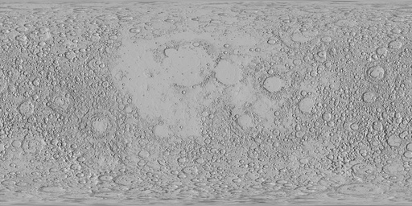

```
                 _        _                   
                | |      | |                  
 __   _____  ___| |_ __ _| |_   _ _ __   __ _ 
 \ \ / / _ \/ __| __/ _` | | | | | '_ \ / _` |
  \ V /  __/\__ \ || (_| | | |_| | | | | (_| |
   \_/ \___||___/\__\__,_|_|\__,_|_| |_|\__,_|
```

# ABOUT:

Vestaluna is a simple GUI app that I use for fetching datasets from NASA's trek APIs, this data arrives in tile(wmts) form so, they need to be stitched together to make huge-ass textures, textures which I use on models in blender, and UE5 like [this](https://www.youtube.com/watch?v=-s9tgamAKEE).

You could build your own version of a tool like this, it's pretty simple! as if effectively just hits WMTS endpoints' xml-based api to get link builders that look akin to this:
`https://{WMTS endpoint}/1.0.0/{Style}/{TileMatrixSet}/{TileMatrix}/{TileRow}/{TileCol}.png`, from which you can, with code sub in the values you're after.
The app itself works like [this](https://www.youtube.com/watch?v=aCJl8exQUXs).

Contributions/feedback etc are welcome.

## ROADMAP:

- [] Need to address the elephant in the room which is rate-limiting, the NASA api will limit you to 1000 requests per hour, that's not a lot of tiles considering the amounts the app could try to fetch (42k for example).
- [] fix too many open files... [latest crash on my system was a 2048 img fetch] `ps -aux| rg vestaluna`
- [] Need Docs to support >>> `godoc -http:=6060` then in your browser hit up `http://localhost:6060/pkg/`
- [] Need to scrape all these for WMTSCapabilities.xml entries... `https://trek.nasa.gov/tiles/apidoc/index.html`
- [] Need to sort the unresponsive UI when downloading -- or do we keep that?
- [] Need a more elegant way to exit. TODO: quit button
- [] Need a more elegant way to set the download path -- maybe a user wants their stitched results to go to ~/Pictures for example.
- [] Needs a code review from other eyes..
- [] UI code needs to be broken out into its own thing.
- [] build instructions for cutting a binary the [Fyne way.](https://developer.fyne.io/started/packaging)
- [] Make an icon for the app with dalle

---

## Requirements:

1. _This_ repo: `git clone https://github.com/alphastrata/vestaluna`.

2. Golang >= 1.18

3. A working internet connection (for `go mod` to work), and for the app too.

4. Some cmdline/terminal proficiency.

5. A browser, if you're wanting to read documentation generated by godoc.
- `NOTE:You may need to restart your machine/relogin to your shell (depending on your os). `

## Building:

- `go mod tidy`
- `go build main.go`

## Usage:

- `./main` (after you've built it) or,
- `go run main.go` (if you want to build and run)

## Testing:

From your terminal of choice:

- `go test -v` (you can omit the `-v` flag if you're only wanting to see failing tests)
  NOTE: there are no tests...

---

### Data:

```
https://trek.nasa.gov/tiles/Moon/EQ/LRO_LOLA_Shade_Global_128ppd_v04/1.0.0/WMTSCapabilities.xml
https://trek.nasa.gov/tiles/Moon/EQ/LRO_LOLA_Shade_Global_256ppd_v06/1.0.0/WMTSCapabilities.xml
https://trek.nasa.gov/tiles/Moon/EQ/LRO_LOLA_ClrRoughness_Global_16ppd/1.0.0/WMTSCapabilities.xml
https://trek.nasa.gov/tiles/Mercury/NP/Mercury_MESSENGER_mosaic_npole_250m_2013/1.0.0/WMTSCapabilities.xml
https://trek.nasa.gov/tiles/Titan/EQ/Titan_global_32ppd_ColorRatio_v2/1.0.0/WMTSCapabilities.xml
https://trek.nasa.gov/tiles/Mars/EQ/Mars_MOLA_blend200ppx_HRSC_ClrShade_clon0dd_200mpp_lzw/1.0.0/WMTSCapabilities.xml
...
```

---

## Example Gallery:

- 

- 

- 

- 

- 

- 

- 

- 

- 

---

# DONE:
- [x] fix fetching out of range (i.e you shouldn't be able to request an INVALID LOD)
- [x] fix concat ordering problem
- [x] fixed simple concat to work -- ordering is still a mess..
- [x] fixed the open-files limit on the wmts.go scraper
- [x] fixed up README.md so it's almost serviceable
- [x] found the `map` issue you're having in `tools.go`
- [x] get the width/height/row/col numbers from the api for the concatenator in tools/tools.go
- [x] get tiles onto some geometry (UE5?) or Unity? or Godot, which has go bindings...
- [x] impl a reader for a database-like for all those WMTSCaps.xml files ey... where are they gonna live?
- [x] install ue5 on linux
- [x] investgate a simple gocv viewer?
- [x] investigate non rectangular (w==h*2) dataset concat problems
- [x] investigate pipeline from big texture onto shpereical geometry (blender?) (ue5)?
- [x] investigate the concat not being able to fit everything into ram...
- [x] investigate the gallery at `8000` on localhost re that github question you posted
- [x] reimplement smart concat helpers in `tools.go`
- [x] scrape the WMTS nasa db -- at least so you can get em on the fly.
- [x] seperate the xml parsing and the scraper, the scraper can go into tools/scraper.go
- [x] started breakout files into proper packages and dir structure
- [x] test that the scraper works on scraping tiles from any of the .xml formats provided by the NASA Api
